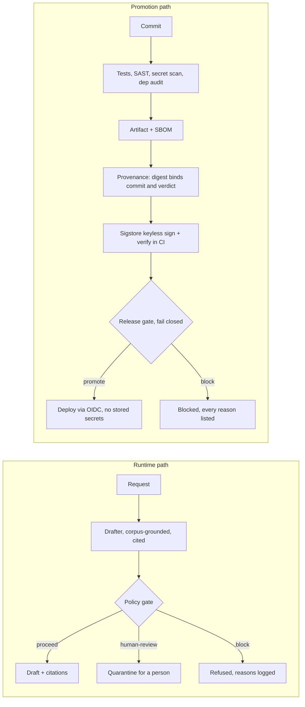

# Airlock

**A fail-closed promotion path for AI services: from experimentation to
production without trusting anyone's good day.**

One claim, stated precisely: *within this reference workflow, an AI service
is not promoted unless its source, dependencies, policy decision, and deploy
identity meet explicit, verifiable controls, and every failure fails closed.
The workflow is the decision layer; what makes it binding in a real estate is
the platform configuration spelled out in [SECURITY-CONTROLS.md](SECURITY-CONTROLS.md).*

Teams building with AI are fast now. Vibe-coded prototypes become real
products in days. The place organizations get hurt is not the prototype; it
is the jump from prototype to production, where a mistake stops being a bug
and starts being an attack surface. Airlock is a deliberately small reference
implementation of that jump for a Python AI service on the Azure Functions
model, built so every control is legible, testable, and honest about its
limits.

## What is actually here

One AI request path, one release path, four demonstrated rejections.



- **Runtime path** (`app/`): a briefing drafter that only speaks from a local
  corpus with citations, behind a policy gate that classifies data
  (member-confidential quarantines for a human, restricted PII refuses,
  unknown classes fail closed), trips on crude injection patterns in input
  AND retrieved content, enforces a tool allowlist, and never logs content,
  only hashes. The model is a deterministic mock so everything runs keyless;
  swapping in a real model changes one function and none of the controls.
- **Promotion path** (`app/release_gate.py`, `app/provenance.py`,
  `scripts/build_release.py`, `.github/workflows/airlock.yml`): evidence in,
  verdict out. A release manifest must show passing tests above a count
  floor, clean scans, an SBOM for the exact artifact, and a provenance
  statement whose digests bind artifact to commit to policy verdict. Risk
  tiers scale human approval: touching the gate itself takes two named
  people. In CI the artifact and statement are signed with sigstore/cosign
  keyless signing and verified against the workflow's own identity.
- **The docs are half the point**: [THREAT-MODEL.md](THREAT-MODEL.md) maps
  each control to the threat it addresses and states what it does NOT stop.
  [SECURITY-CONTROLS.md](SECURITY-CONTROLS.md) is the honest boundary
  between decision (this repo) and enforcement (branch protection,
  environments, Azure federated-credential claims).
  [LIMITATIONS.md](LIMITATIONS.md) says plainly what is real, what is a
  template, and what only a tenant review can verify.

## The five-minute skeptic's path

Nothing below requires keys, cloud, or trust in this README.

```bash
# 1. Clean checkout reproduces the whole promotion path (tests -> artifact ->
#    SBOM -> gate verdict -> policy-binding statement, verified from disk):
pip install -r requirements-dev.txt
python -m pytest -q
python scripts/build_release.py --commit $(git rev-parse HEAD)

# 2. Watch it refuse (exit nonzero, every reason listed):
python -m app.release_gate examples/manifest-block-tampered.json    # digest mismatch
python -m app.release_gate examples/manifest-block-high-tier.json   # missing second approver

# 3. Verify what CI shipped, against CI's own identity (no local trust):
gh attestation verify <downloaded airlock-app.zip> --repo Polycentric-Labs/airlock
cosign verify-blob airlock-app.zip --bundle airlock-app.zip.sigstore.json \
  --certificate-identity "https://github.com/Polycentric-Labs/airlock/.github/workflows/airlock.yml@refs/heads/main" \
  --certificate-oidc-issuer https://token.actions.githubusercontent.com
```

A successful verification proves the artifact came from this repository's
`airlock.yml` workflow at a specific commit. It proves origin, never safety;
that distinction is load-bearing and repeated wherever signing is mentioned.
The tamper case also exists at the byte level: `tests/test_provenance.py`
flips one byte of an attested artifact and shows verification fail.

## Design positions (the part that is actually about security)

1. **Fail closed, no warn state.** Warnings in a promotion path decay into
   wallpaper. Anything missing, malformed, or unknown is a block with a
   reason.
2. **No third-party runtime dependencies.** The service and gate code are
   Python stdlib (the Azure Functions host SDK is the deploy-time exception,
   listed separately). The SBOM is short because the attack surface is short.
   Dev tooling is separate and audited.
3. **Gate, bind, then sign.** The release gate rules on measured evidence
   first; the policy-binding statement then binds artifact digest to commit
   to the REAL verdict; only then is anything signed. Build provenance comes
   from GitHub's native artifact attestations (SLSA v1 provenance, Build L2
   by default; L3 would require reusable-workflow isolation). A signature
   proves workflow identity, never code safety.
4. **Humans scale with risk.** Standard changes flow. Elevated changes take a
   named person. Changes to the gate itself take two, because the quietest
   attack is editing the definition of passing.
5. **The pipeline is an attack surface.** Actions pinned to commit SHAs,
   read-only default token, no privileged jobs on fork PRs, no stored cloud
   secrets anywhere: deploy identity is OIDC federation with claims scoped to
   repo and environment.
6. **Assist, do not replace.** The runtime gate returns plain-English reasons
   and quarantines rather than lecturing; blocked and quarantined requests are
   review input for tuning the rules, with the explicit goal of reducing
   friction for safe requests.

## First 10 business days on a real greenfield AI product

This repo is the shape of the first two weeks, not a finished platform:
map data flows, identities, tools, and deploy paths (days 1 to 3); stand up
the minimum promotion gate on the first service and get one real release
through it (days 3 to 6); threat-model the highest-risk workflow with the
team, not at them (days 6 to 8); wire evidence generation into CI so the gate
stops being advisory (days 8 to 10); leave behind a one-page exception path,
because a gate without a legible exception path gets bypassed, not respected.
An exception here means an audited policy state, not a bypass: a named
approver, a written reason, a hard expiry date, and the exception itself
recorded in the release evidence so it shows up in the audit trail.

## Portability

The workflow is GitHub Actions because that is where this reference lives;
the pattern (evidence jobs, OIDC deploy identity, environment approvals,
pinned dependencies) maps one-to-one onto Azure DevOps Pipelines with
service connections and environment checks. The gate and provenance modules
are plain Python and do not care who runs them.

## Provenance of this repo, stated plainly

Built AI-assisted in a compressed window, the same acceleration pattern most
AI teams use now, with the controls applied to the acceleration itself: scope
cut deliberately small, every module reviewed, the test suite (rejection and
tamper cases included) written and green, scanners run in CI on every push,
limitations documented instead of discovered. The
deeper, slower record of the same discipline is public:
[Evidentia](https://github.com/Polycentric-Labs/evidentia) (open-source GRC
platform: signed evidence, SBOM, Sigstore, 4,900+ tests),
[Voidseal](https://github.com/Polycentric-Labs/voidseal) (fail-closed,
risk-tiered sandboxing for untrusted code and agents), and
[RegRails](https://github.com/Polycentric-Labs/regrails) (policy-as-code
guardrail that decides before a model speaks).

## License

Apache-2.0
